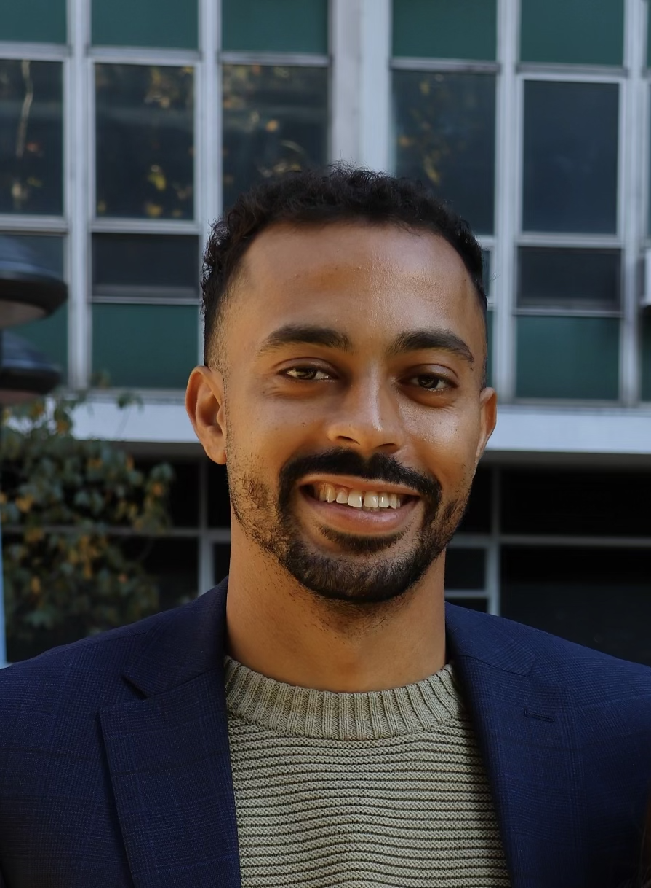

<!-- Google tag (gtag.js) -->

  
  

    <h1 style="color: #cc0000;">{{ site.jekyllacademic.homepage_title }}Hello World!</h1> 
  
  Welcome. My name is Brendan Brundage. I will be joining Morehouse College as an Assistant Professor of Economics in August 2025. 

    
 
   
I have a Ph.D. in Economics from Colorado State University. Before that, I received my masters' degree in Economics at Florida Atlantic University, and my bachelors' degree in Economics from Rollins College. I played four years of college baseball and now I enjoy playing basketball and golf in my free time.

    

My primary research is focused on Development, Economic History, History of Economic Thought, and Political Economy. In general, my work seeks to explain differential development patterns for specific groups, like the racial wealth gap in the United States, as well as for developing regions, such as the Caribbean. My academic work has been published in <em>Review of Black Political Economy</em> and <em>Sociology of Development</em>. You can find more information about my work in the <a href="https://brendanbrundage.github.io/research/">Research Page</a>.

I've also had the pleasure of teaching throughout my graduate school years at Colorado State University and Florida Atlantic University. I've served as both an instructor and assistant for various courses at the graduate and undergraduate levels. More information is found in the <a href="https://brendanbrundage.github.io/teaching/">Teaching Page</a>.

You can contact me by clicking one of the social images at the bottom of this page. Also, my contact information is in the <a href="https://brendanbrundage.github.io/files/Brundage_CV.pdf">CV</a>. 

<h1 style="color: #cc0000;">{{ site.jekyllacademic.homepage_title }}Hello World!</h1> 

Welcome. My name is Brendan Brundage, and I am a Ph.D. candidate in the Department of Economics at Colorado State University. I will be joining Morehouse College as an Assistant Professor in August 2025. 

Previously, I received my masters' degree in Economics at Florida Atlantic University in 2020, and my bachelors' degree in Economics from Rollins College in 2019. I played four years of college baseball and now I enjoy playing basketball and golf in my free time.

My primary research is focused on Development, Economic History, History of Economic Thought, and Political Economy. In general, my work seeks to explain differential development patterns for specific groups, like the racial wealth gap in the United States, as well as for developing regions, such as the Caribbean. My academic work has been published in *Review of Black Political Economy* and *Sociology of Development*. You can find more information about my work in the [research](research) page.

I've also had the pleasure of teaching throughout my graduate school years at Colorado State University and Florida Atlantic University. I've served as both an instructor and assistant for various courses at the graduate and undergraduate levels. More information is found in the [teaching](teaching) page.

You can contact me by clicking one of the social images at the bottom of this page. Also, my contact information is in the [cv](cv).
